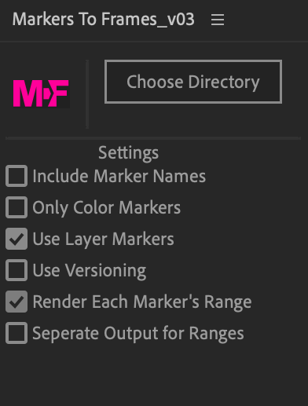

# MarkersToFrames
After Effects Script UI for conveniently rendering frames from Markers and Marker Ranges.

## Installation
1. Download MarkersToFrames.jsx from the above file list.
2. In After Effects, navigate to File > Scripts > Install ScriptUI Panel...
3. Select MarkersToFrames.jsx
4. Open MarkersToFrames.jsx in Windows menu.

## Usage

### Basic Usage
1. Open the MarkersToFrames ScriptUI Panel.
2. Create an Output Module for MTF by going to Edit > Template > Output Modules... and making a new one titled "MarkerToFrame." Recommended Settings: PNG Sequence, Trillions of Colors, RGB+A.
3. Open a composition with Markers in your Timeline or select multiple compositions in your Project panel. (MTF prioritizes compositions selected in the project panel.)
4. Click Choose Directory to pick your output directory for your Frames.
5. Press the "M > F" button! 
6. If nothing occurs, be sure you have the Project Panel or your selected Composition open and focused (a blue line should frame the window.)

### Settings
"Include Marker Names" appends the name/comment attached to a marker to the output frame's filename.

"Only Color Markers" will filter all unlabelled markers.

"Use Layer Markers" is enabled by default. When checked, composition and layer markers will be rendered. When unchecked, only composition markers will be rendered. If a Marker is on a layer, its layer name will be included on the marker.

"Use Versioning" will version up your frames each time they are rendered, so long as the amount of frames, placement, and naming is consistent. Otherwise, same markers will be overwritten.

"Render Each Marker's Range" will render every frame within the range of Markers that have a range. This is disabled by default.

"Seperate Output for Ranges" allows you to specify a different type of Output Module for Markers who are rendered as a range. You must make this Output Module and it should be titled "MarkerRangeToFrames"

#### Current Issues
- Adding Frame Numbers to Range Outputs that are not Frame Sequences (e.g. an .MOV or .MP4) produces a useless frame token made of hyphens.

#### Changelog
Initial Commit -- Added basic functionality and panel.
